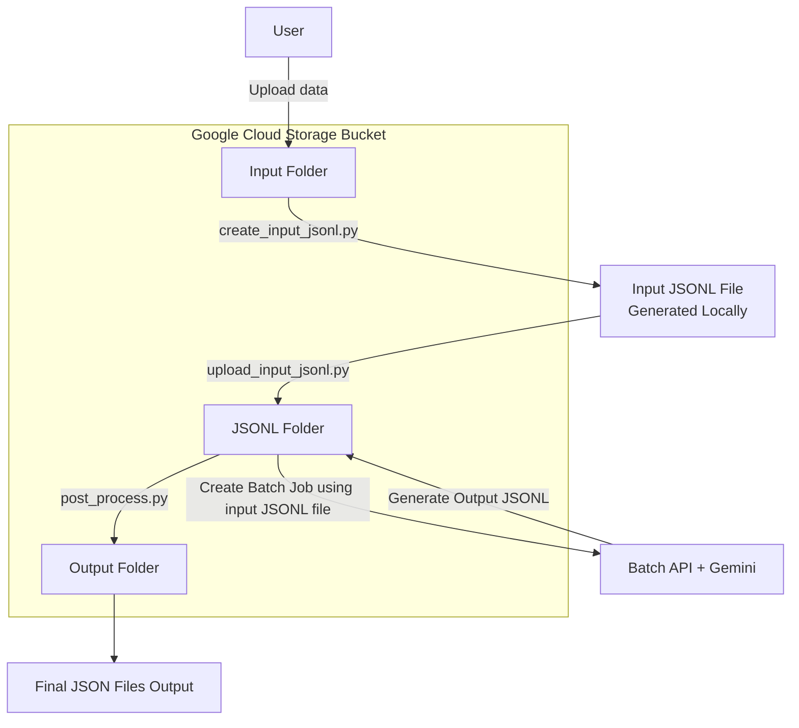

```mermaid
flowchart

%% User
U[User]

%% Local artifact
L[Input JSONL File<br>Generated Locally]

%% GCS bucket
subgraph GCS["Google Cloud Storage Bucket"]
    B[Input Folder]
    C[JSONL Folder]
    D[Output Folder]
end

%% Cloud services
E[Batch API + Gemini]

%% Final output
G[Final JSON Files Output]

U -->|Upload data| B
B -->|create_input_jsonl.py| L
L -->|upload_input_jsonl.py| C

C -->|Create Batch Job using input JSONL file| E
E  -->|Generate Output JSONL| C

C -->|post_process.py| D
D --> G

```